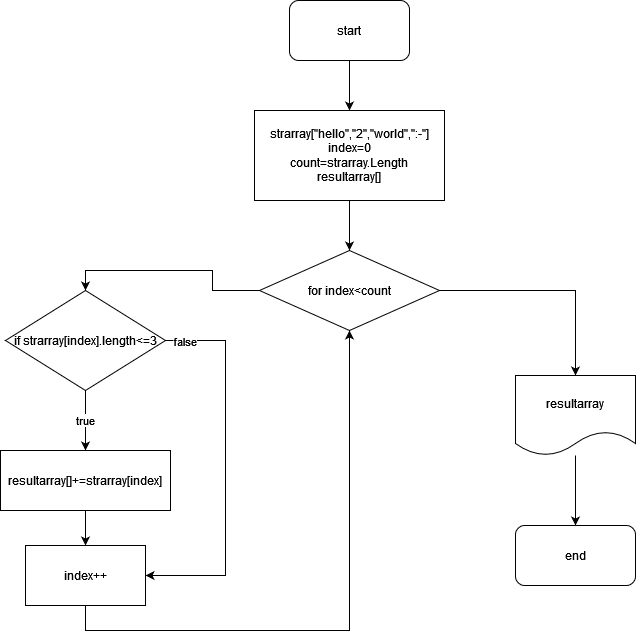

**Итоговое задание для 1ой четверти.**

* Создать репозиторий в гитхаб  ✔
* Нарисовать блок схему ✔
* Текстовое описание решения ✔
* Программа которая решает задачу ✔
* Создать несколько комитов ✔

**Блок схема для поставленной задачи:**

**Текстовое описание решения:**

*Метод* `ArrayGen1D`  создает одномерный массив из N элементов и заполняет его данными введенными пользователем.

*Метод* `ArrayPrint1D` печатает массив, выделяем его скобками, а элементы разделяя запятыми.

*Метод* `ArrayModNValue` создает новый массив на основе другого из N Элементов, которые удовлетворяют размеру V введеным пользователем